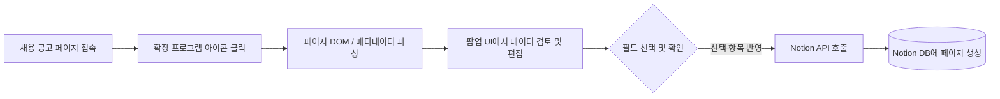

<div align="center">

# 📑 Notion Job Scraper

**한국 주요 채용 플랫폼의 공고를 클릭 한 번으로 Notion 지원 현황 데이터베이스에 스마트하게 수집·저장하는 브라우저 확장 프로그램**

[](CHANGELOG.md)
[](#)
[](https://www.typescriptlang.org/)
[](https://react.dev/)
[](https://wxt.dev/)
[](extension/package.json)
[](LICENSE)

<br/>

[✨ 주요 특징](#-주요-특징) •
[🌐 지원 플랫폼](#-지원-플랫폼) •
[🔄 동작 워크플로우](#-동작-워크플로우) •
[🚀 빠른 시작 (설치 및 연동)](#-빠른-시작-설치-및-연동) •
[📊 Notion DB 구조](#-notion-데이터베이스-구조) •
[🛠 개발 및 빌드](#-개발-및-빌드-가이드) •
[❓ 자주 묻는 질문](#-자주-묻는-질문-faq)

</div>

---

> [!IMPORTANT]
> **100% 프라이버시 중심 & 완전 수동 실행 방식**
> 본 확장 프로그램은 웹 서핑 중 데이터를 백그라운드에서 무단 수집하거나 전송하지 않습니다.
> 사용자가 브라우저 툴바의 **확장 아이콘을 직접 클릭했을 때만** 현재 페이지의 채용 정보를 파싱하며,
> 미리보기 폼에서 내용을 확인하고 승인한 데이터만 사용자의 Notion 워크스페이스로 전송됩니다.

---

## ✨ 주요 특징

- **🛡️ 프라이버시 우선 (Zero-Tracking)**: 백그라운드 상시 수집 제로. 사용자의 명시적 클릭 시에만 동작
- **🎯 정밀 스크래핑 엔진**: 원티드, 사람인, 잡코리아, 자소설닷컴의 최신 웹 구조(JSON-LD, Next Data, DOM) 맞춤 파싱
- **✍️ 완벽한 데이터 제어 (Review & Edit)**: 저장 전 직무명, 회사명, 마감일, 본문 요약 자유 수정 및 불필요한 필드 제외 가능
- **📅 스마트 마감일 처리 (DatePicker)**: 상시 채용 및 비정형 마감일도 캘린더 피커를 통해 정확한 날짜(`YYYY-MM-DD`)로 지정
- **🔑 2가지 연동 모드 지원**:
  - **직접 연동 (Manual API Key)**: Notion 내부 통합 키와 링크만 입력하여 별도 프록시 서버 배포 없이 즉시 단독 사용
  - **간편 연동 (OAuth 2.0)**: Vercel 프록시 서버를 통한 원클릭 워크스페이스 연결
- **🗂️ 원클릭 DB 자동 생성**: 기존 Notion DB 연결뿐만 아니라, 상위 페이지만 지정하면 채용 관리 DB 자동 생성 지원
- **🌐 범용 수동 입력 지원 (Manual Fallback)**: 지원 사이트 외 페이지에서도 탭 제목/URL 기반 간편 입력 및 저장 가능

---

## 🌐 지원 플랫폼

| 채용 사이트 | 대상 URL 패턴 | 파싱 및 추출 전략 | 지원 데이터 |
|:---|:---|:---|:---:|
| **원티드 (Wanted)** | `wanted.co.kr/jobdetail/*` | `__NEXT_DATA__` JSON + SPA 라우트 감지 + DOM 폴백 | 직무명, 회사명, 마감일, 설명, URL |
| **사람인 (Saramin)** | `saramin.co.kr/zf_user/jobs/view*` | `JSON-LD` 구조화 데이터 + D-Day 정규식 파싱 + DOM | 직무명, 회사명, 마감일, 설명, URL |
| **잡코리아 (JobKorea)** | `jobkorea.co.kr/Recruit/GI_Read/*` | `JSON-LD` 구조화 데이터 + 마감일 포맷팅 + DOM | 직무명, 회사명, 마감일, 설명, URL |
| **자소설닷컴** | `jasoseol.com/recruit/*` | DOM 선택자 + OpenGraph 메타데이터 폴백 | 직무명, 회사명, 마감일, 설명, URL |
| **기타 채용 페이지** | 모든 웹 페이지 | 브라우저 탭 URL/제목 자동 감지 + 수동 폼 입력 모드 | 직무명, 회사명, 마감일, 설명, URL |

---

## 🔄 동작 워크플로우



### 단계별 이용 방법

1. **공고 페이지 이동**: 지원 대상 채용 사이트에서 상세 공고 페이지를 엽니다.
2. **확장 프로그램 실행**: 브라우저 우측 상단 툴바의 **Notion Job Scraper** 아이콘을 클릭합니다.
3. **데이터 검토 및 수정**:
   - 자동 추출된 직무명, 회사명, 마감일, 공고 URL, 상세 내용을 검토합니다.
   - 마감일이 상시 채용이거나 다를 경우 **달력(DatePicker)** 아이콘을 눌러 원하는 날짜를 선택합니다.
   - 저장할 필요가 없는 필드는 체크박스를 해제합니다.
4. **Notion에 저장**: **"📥 선택한 항목 Notion에 저장"** 버튼을 누르면 즉시 동기화가 완료됩니다.

#### 팝업 필드 편집 옵션

| 필드명 | 편집 가능 여부 | 선택 해제 여부 | 설명 및 저장 위치 |
|:---|:---:|:---:|:---|
| **직무명 (Title)** | ✅ 가능 | ❌ 필수 | Notion 페이지의 메인 타이틀(Title 속성) |
| **회사명 (Company)** | ✅ 가능 | ✅ 가능 | 채용 기업명 (체크 해제 시 속성 공란 처리) |
| **마감일 (Deadline)** | ✅ (DatePicker) | ✅ 가능 | 마감 일자 (Notion 캘린더 뷰 연동 지원) |
| **공고 링크 (URL)** | ✅ 가능 | ❌ 필수 | 원본 채용 공고 바로가기 URL |
| **직무 설명 (Description)** | ✅ (Textarea) | ✅ 가능 | 페이지 본문 블록(Body Block)으로 저장 |

---

## 🚀 빠른 시작 (설치 및 연동)

확장 프로그램을 브라우저에 설치한 뒤 아래의 두 가지 연동 방식 중 하나를 선택하세요.

### 1. 확장 프로그램 설치

#### Chrome / Edge (Chromium 계열)
1. 프로젝트 루트에서 `npm run build:ext` 실행 (또는 릴리즈 압축 파일 해제)
2. Chrome 브라우저 주소창에 `chrome://extensions/` 입력
3. 우측 상단 **개발자 모드 (Developer mode)** 활성화
4. **"압축 해제된 확장 프로그램을 로드합니다"** 클릭 후 `extension/.output/chrome-mv3` 폴더 선택

#### Firefox
1. 프로젝트 루트에서 `npm run build:ext:firefox` 실행
2. Firefox 주소창에 `about:debugging` 접속
3. **"이 Firefox"** 탭 선택 ➔ **"임시 확장 기능 로드..."** 클릭
4. `extension/.output/firefox-mv2/manifest.json` 파일 선택

---

### 2. Notion 연동 방식 선택

> [!TIP]
> **어떤 연동 방식을 선택해야 할까요?**
> - **개인 사용자 (가장 추천)**: **방법 A (직접 연동)** 를 사용하세요. 프록시 서버 배포 없이 1분 만에 끝납니다.
> - **팀 / 다수 사용자 배포**: **방법 B (OAuth 2.0)** 를 사용하면 사용자가 API 키를 만들 필요 없이 간편 로그인으로 사용할 수 있습니다.

<details open>
<summary><b>방법 A. 직접 연동 (API 키 모드 - 권장, 별도 서버 불필요)</b></summary>

별도의 서버 배포나 복잡한 설정 없이, 개인 Notion 시크릿 토큰과 데이터베이스 링크만으로 즉시 연동합니다.

1. **Notion 통합(Integration) 생성**:
   - [Notion 통합 설정 페이지](https://www.notion.so/profile/integrations)에 접속하여 **"+ 새 통합 만들기"** 클릭
   - 이름 입력(예: `Job Scraper`) 후 **"저장"**
   - 발급된 **내부 통합 시크릿 토큰(`secret_...`)** 복사
2. **Notion 페이지/데이터베이스에 권한 부여**:
   - 공고를 저장할 Notion 데이터베이스(또는 상위 페이지)를 엽니다.
   - 페이지 우측 상단 `···` 메뉴 ➔ **"연결 (Add connections)"** ➔ 1단계에서 만든 통합 선택 및 허용
3. **확장 프로그램에서 연결**:
   - 확장 프로그램 아이콘 클릭 ➔ 설정 탭 이동
   - **"직접 연동 (API 키)"** 탭 선택
   - 복사한 **시크릿 키(`secret_...`)** 와 **Notion 데이터베이스 링크** 붙여넣기 ➔ **"직접 연결하기"** 클릭

</details>

<details>
<summary><b>방법 B. OAuth 2.0 연동 (Vercel 프록시 서버 활용)</b></summary>

Notion 계정 로그인 팝업을 통해 워크스페이스를 원클릭으로 연동하는 방식입니다. (OAuth Client Secret 보호를 위해 프록시 서버 필요)

1. **Notion 퍼블릭 통합 등록**:
   - [Notion 개발자 콘솔](https://www.notion.so/profile/integrations)에서 **"공용(Public)"** 통합 생성
   - Redirect URI에 `https://<확장ID>.chromiumapp.org/` (Chrome) 등록
   - `NOTION_CLIENT_ID` 및 `NOTION_CLIENT_SECRET` 발급 확인
2. **Vercel 토큰 프록시 서버 배포**:
   ```bash
   cd server
   npm install
   vercel env add NOTION_CLIENT_ID
   vercel env add NOTION_CLIENT_SECRET
   vercel --prod
   ```
3. **확장 프로그램 빌드 환경 설정**:
   - `extension/.env`에 프록시 URL 및 Client ID 지정:
     ```env
     VITE_NOTION_CLIENT_ID=your_client_id
     VITE_PROXY_URL=https://your-server.vercel.app
     ```
4. 확장 프로그램 팝업의 **"간편 연동 (OAuth)"** 탭에서 **"Notion으로 연결하기"** 버튼 클릭

</details>

---

## 📊 Notion 데이터베이스 구조

확장 프로그램이 자동으로 채용 공고를 저장할 수 있도록 Notion 데이터베이스에 아래 속성을 구성합니다.
*(확장 프로그램 내 "새 페이지 생성" 기능을 이용하면 자동으로 표준 스키마가 생성됩니다.)*

| 속성 이름 (Property) | Notion 속성 타입 | 필수 여부 | 매핑 데이터 및 용도 |
|:---|:---|:---:|:---|
| **Title** | 제목 (`title`) | 필수 | 채용 직무명 |
| **Company** | 텍스트 (`rich_text`) | 선택 | 회사 / 기업명 |
| **URL** | 링크 (`url`) | 필수 | 원본 채용 공고 링크 |
| **Deadline** | 날짜 (`date`) | 선택 | 공고 마감일 (캘린더 뷰 지원) |
| **Status** | 선택 (`select`) | 선택 | 지원 상태 (기본값: "지원 예정") |

> [!NOTE]
> **직무 상세 설명(Description)** 은 속성이 아닌 **페이지 본문 블록(Body paragraph)** 에 서식과 함께 깔끔하게 기록됩니다.

---

## 🛠 개발 및 빌드 가이드

본 저장소는 확장 프로그램, 서버리스 프록시, 웹 대시보드를 갖춘 모노레포 구조입니다.

### 디렉터리 구성

```
notion-job-scraper/
├── extension/             # WXT 기반 크로스 브라우저 확장 프로그램 (React + TypeScript)
│   ├── entrypoints/
│   │   ├── popup/         # 팝업 UI (TanStack Router & Query, Tailwind CSS)
│   │   ├── content/       # 사이트별 스크래퍼 (수동 트리거 리스너)
│   │   └── background/    # Notion API 통신 & OAuth 세션 관리
│   └── utils/             # 스토리지, 공통 에러 핸들러, Sanitizer, 파서
├── server/                # Vercel OAuth 토큰 교환 프록시 (Node.js)
├── web/                   # 공고 조회 웹 대시보드 (Vite + React)
└── scripts/               # 버전 범프, 번들 검증, 스토어 제출 자동화 스크립트
```

### 필수 요구사항
- Node.js 18.0.0 이상
- npm 9.0.0 이상

### 주요 실행 스크립트

루트 디렉터리에서 모든 워크스페이스의 스크립트를 즉시 실행할 수 있습니다:

```bash
# 1. 의존성 설치
npm install
cd extension && npm install && cd ../server && npm install

# 2. 로컬 개발 서버 실행 (핫 리로드 지원)
npm run dev:ext            # Chrome 확장 개발 모드
npm run dev:ext:firefox    # Firefox 확장 개발 모드
npm run dev:server         # Vercel 프록시 로컬 서버

# 3. 테스트 실행 (Unit & Integration Tests)
npm test                   # 전체 테스트 (Extension + Server)
npm run test:ext           # 확장 프로그램 단위 테스트 (Vitest 18개 스위트)
npm run test:server        # 프록시 서버 단위 테스트

# 4. 프로덕션 빌드 및 패키징
npm run build:ext          # Chrome MV3 빌드 (.output/chrome-mv3)
npm run build:ext:firefox  # Firefox MV2 빌드 (.output/firefox-mv2)
npm run package:all        # 배포용 zip 압축 파일 자동 생성
```

### 환경 변수 안내

#### 확장 프로그램 (`extension/.env`)
| 변수명 | 필수 여부 | 설명 |
|:---|:---:|:---|
| `VITE_NOTION_CLIENT_ID` | OAuth 사용 시 필수 | Notion Public OAuth 클라이언트 ID |
| `VITE_PROXY_URL` | OAuth 사용 시 필수 | OAuth 프록시 서버 URL (예: `https://notion-job-scraper.vercel.app`) |

#### 프록시 서버 (`server/.env.local` 또는 Vercel 환경 변수)
| 변수명 | 필수 여부 | 설명 |
|:---|:---:|:---|
| `NOTION_CLIENT_ID` | 필수 | Notion Public OAuth 클라이언트 ID |
| `NOTION_CLIENT_SECRET` | 필수 | Notion Public OAuth 시크릿 키 (**절대 외부에 노출 금지**) |

---

## ❓ 자주 묻는 질문 (FAQ)

<details>
<summary><b>Q. 사이트를 돌아다닐 때 자동으로 내 개인정보나 열람 기록이 수집되나요?</b></summary>

**절대 그렇지 않습니다.**
본 확장은 브라우징 활동을 감시하거나 추적하지 않습니다. 사용자가 직접 확장 프로그램 아이콘을 클릭한 순간에만 활성화 탭의 DOM을 1회 읽어오며, 사용자가 확인 버튼을 누르기 전까지는 외부로 어떤 데이터도 전송되지 않습니다.
</details>

<details>
<summary><b>Q. "Database를 찾을 수 없습니다" 또는 404 오류가 발생합니다.</b></summary>

대부분 Notion 데이터베이스에 통합(Integration) 권한이 공유되지 않아 발생합니다.
1. 저장하려는 Notion 데이터베이스 페이지로 이동합니다.
2. 페이지 우측 상단 `···` (메뉴) 버튼을 클릭합니다.
3. **"연결 (Add connections)"** 을 누르고 사용 중인 통합(Integration)을 검색하여 추가해 주세요.
</details>

<details>
<summary><b>Q. 마감일이 상시 채용이거나 이상하게 파싱됩니다.</b></summary>

채용 사이트마다 마감일 표기 방식이 달라 파싱이 누락되거나 다를 수 있습니다.
이 경우 팝업 UI의 **마감일 달력(DatePicker) 아이콘**을 클릭하여 원하는 날짜를 직접 선택하시면 Notion 표준 날짜 포맷(`YYYY-MM-DD`)으로 안전하게 저장됩니다.
</details>

<details>
<summary><b>Q. 특정 채용 공고의 파싱이 제대로 되지 않습니다.</b></summary>

채용 플랫폼의 UI나 마크업 구조가 개편되었을 수 있습니다.
문제가 발생하는 **공고 URL**과 함께 [GitHub Issues](https://github.com/lij0825/notion-job-scraper/issues)에 제보해 주시면 신속하게 업데이트하겠습니다.
</details>

<details>
<summary><b>Q. 같은 공고를 실수로 여러 번 저장하면 어떻게 되나요?</b></summary>

확장 프로그램은 매 저장 요청마다 Notion DB에 새로운 행(Page)을 생성합니다. 중복 방지나 상태 관리가 필요하신 경우 Notion DB의 필터 뷰나 속성을 활용하시기 바랍니다.
</details>

---

## 📄 라이선스

본 프로젝트는 [MIT License](LICENSE) 하에 자유롭게 사용, 수정 및 배포할 수 있습니다.
